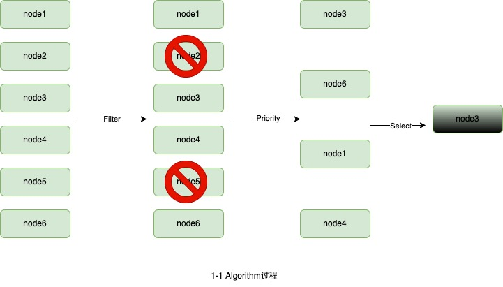
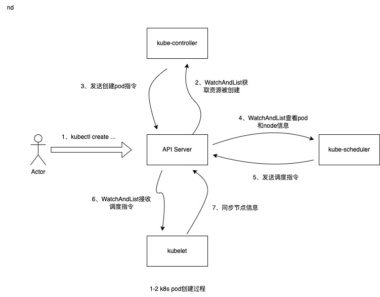

# K8S调度器原理剖析


## 基本概念 

在k8s中，pod是最小的原子调度单位。 调度器的职责就是将新创建或未被调度的pod挑选出最适合的node， 并将这个调度结果发送给`API-SERVER` 。

具体挑选最合适的node的过程可以分为两个阶段：

* 在集群的所有节点中过滤出所有可以运行该pod的node。

* 根据调度算法对上一步筛选出的所有node节点进行打分， 得分最高的作为最终的调度结果。

  




## pod创建过程概览




* 当通过`kubectl`发送一个pod创建指令时，`kube-controller`检测到资源的创建， 并根据参数创建出pod的实例发送给`api-server`。
* `kube-scheduler`调度器检测到新的未被调度的pod，就会根据调度算法从node节点中选出最合适的node与其绑定，并向`api-server`发送绑定指令。
* 部署在对应节点上的`kubelet`检测到`api-server`中的绑定指令后， 就会通过本地的container api， 让其节点上运行这个pod。


## 源码解析

和公司版本保持一致， 以下代码均摘自`release-1.20`版本。

### 调度器

```go
// Scheduler watches for new unscheduled pods. It attempts to find
// nodes that they fit on and writes bindings back to the api server.
type Scheduler struct {
	// It is expected that changes made via SchedulerCache will be observed
	// by NodeLister and Algorithm.
  // 缓存， 优化调度性能
	SchedulerCache internalcache.Cache
  // 调度算法， 接口类型，可自定义调度算法
	Algorithm core.ScheduleAlgorithm

	// NextPod should be a function that blocks until the next pod
	// is available. We don't use a channel for this, because scheduling
	// a pod may take some amount of time and we don't want pods to get
	// stale while they sit in a channel.
  // 从activeQ中获取下一个待调度的pod
	NextPod func() *framework.QueuedPodInfo

	// Error is called if there is an error. It is passed the pod in
	// question, and the error
	Error func(*framework.QueuedPodInfo, error)

	// Close this to shut down the scheduler.
  // 调度停止信号
	StopEverything <-chan struct{}

	// SchedulingQueue holds pods to be scheduled
	SchedulingQueue internalqueue.SchedulingQueue

	// Profiles are the scheduling profiles.
  // 存储一些调度属性， 用于判断哪些pod可以被调度器调度
	Profiles profile.Map
  // client-go. 用于和api-server通信
	client clientset.Interface
}
```


```go
// Run begins watching and scheduling. It waits for cache to be synced, then starts scheduling and blocked until the context is done.
func (sched *Scheduler) Run(ctx context.Context) {...}

// scheduleOne does the entire scheduling workflow for a single pod.  It is serialized on the scheduling algorithm's host fitting.
func (sched *Scheduler) scheduleOne(ctx context.Context)

func (sched *Scheduler) profileForPod(pod *v1.Pod)

func (sched *Scheduler) skipPodSchedule(prof *profile.Profile, pod *v1.Pod) bool

func (sched *Scheduler) skipPodUpdate(pod *v1.Pod) bool

// assume signals to the cache that a pod is already in the cache, so that binding can be asynchronous.
// assume modifies `assumed`.
func (sched *Scheduler) assume(assumed *v1.Pod, host string) error {}

func (sched *Scheduler) bind(ctx context.Context, prof *profile.Profile, assumed *v1.Pod, targetNode string, state *framework.CycleState) (err error)

func (sched *Scheduler) finishBinding(prof *profile.Profile, assumed *v1.Pod, targetNode string, start time.Time, err error)
```


### scheduleOne

该方法负责一个`pod`的整个调度流程。

```go
func (sched *Scheduler) scheduleOne(ctx context.Context) {
  // 从scheduleQueue获取待调度的pod
  podInfo := sched.NextPod()
  
  pod := podInfo.Pod
  // 通过pod的schedulerName获取对应的profile配置信息
  fwk, err := sched.frameworkForPod(pod)
  
  // 根据profile和pod信息跳过一些特殊case场景
  // Case 1: pod is being deleted.
  // Case 2: pod has been assumed and pod updates could be skipped.
  if sched.skipPodSchedule(fwk, pod) {
		return
	}
  
  ...
  
  // Synchronously attempt to find a fit for the pod.
  // 通过调度算法找到当前pod最合适的节点
  scheduleResult, err := sched.Algorithm.Schedule(schedulingCycleCtx, fwk, state, pod)
  if err != nil {
    // 尝试抢占
  }
  
  // Tell the cache to assume that a pod now is running on a given node, even though it hasn't been bound yet.
	// This allows us to keep scheduling without waiting on binding to occur.
	assumedPodInfo := podInfo.DeepCopy()
	assumedPod := assumedPodInfo.Pod
  
  // assume modifies `assumedPod` by setting NodeName=scheduleResult.SuggestedHost
  // 将调度结果的node与assumedPod进行绑定
	err = sched.assume(assumedPod, scheduleResult.SuggestedHost)
  
  	// reserve plugins 做节点资源的预定，写入cache， 如节点的volume资源。
    // 后续过程一旦失败， 会调用unreserve方法进行预订回滚。
	if sts := fwk.RunReservePluginsReserve(schedulingCycleCtx, state, assumedPod, scheduleResult.SuggestedHost); !sts.IsSuccess() {
		// trigger un-reserve to clean up state associated with the reserved Pod
    // 失败了进行回滚
		prof.RunReservePluginsUnreserve(schedulingCycleCtx, state, assumedPod, scheduleResult.SuggestedHost)
		return
	}
  
  // Run "permit" plugins.
  // permit 是对 pod 绑定操作进行最后的批准、拒绝或者执行延时调度
  // 可以自定义permitPlugin在reserve之后， bind之前进行拦截[allow, reject, wait]。 
  // allow表示pod允许通过perimit阶段；reject表示pod在permit阶段拒绝， pod调度失败； wait表示pod处于等待状态，可以延迟调度，可    设置超时时间。
	runPermitStatus := fwk.RunPermitPlugins(schedulingCycleCtx, state, assumedPod, scheduleResult.SuggestedHost)
  
  // 异步绑定过程，需要调用api-server的接口
  go func() {
    // 根据上面perimit结果判断是否需要延时调度
    // will block, if the pod is a waiting pod, until the waiting pod is rejected or allowed.
    waitOnPermitStatus := fwk.WaitOnPermit(bindingCycleCtx, assumedPod)
    ...
    // Run "prebind" plugins.
    // 绑定前的准备工作， 如PV、PVC绑定， 默认只有VolumeBinding的plugin
		preBindStatus := fwk.RunPreBindPlugins(bindingCycleCtx, state, assumedPod, scheduleResult.SuggestedHost)
    
    // 向api-server发起节点绑定请求
    err := sched.bind(bindingCycleCtx, prof, assumedPod, scheduleResult.SuggestedHost, state)
    if err != nil {
      // 失败回滚
      prof.RunReservePluginsUnreserve
    } else {
      // 发送请求
      prof.RunPostBindPlugins(bindingCycleCtx, state, assumedPod, scheduleResult.SuggestedHost)
    }
  }
}
```

基于上面的代码走读， 梳理pod调度（scheduleOne）的流程：

* sched.NextPod()，从调度队列中获取待调度的pod对象。
* 通过pod的ScheduleName判断是否属于这个调度器处理，kube-scheduler 的名字是 default-scheduler，因此 pod 没有专门指定调度器的都会被k8s默认调度器处理。

* 通过 sched.Algorithm.Schedule 找到当前 pod 最适合的节点，如果没找到适合的节点，调度器会根据 pod 的优先级进行抢占操作。

* 在通过调度算法找到适合的待调度节点之后就是具体调度了，这里 schedule 设计了一个 assume pod 的对象，这个 assume pod 将原来的 pod 对象深度拷贝放入 scheduler cache 中，并设置 nodeName 表示这个节点已被调度，后续的检查和调度基于 assume pod 对象，这样就可以对 pod 进行异步绑定操作而不会有读写锁的问题了。
* 接着assumePod会针对将要绑定的node进行资源预订， 将预订信息写入cache。 默认只有Volume资源的预定， 可以通过开发ReservePlugin进行其他资源的预定。 Unreserve方法需要在后续流程报错后手动调用， 将预订的资源清理、回滚。
* permit阶段是在pod绑定前进行最后的拦截， 默认只有VolumeBinding的permitPlugin，可以自定义添加各种资源的permitPlugin。permit对pod添加allow，reject，wait的一种状态。
* 最后进入一步绑定阶段。 先通过 WaitOnPermit 方法检查是否需要延迟调度，如果有会阻塞等待； preBind进行pvc、pv的绑定， 然后scheduler向api-server发送bind请求。


### Algorithm

Algorithm是调度器的核心调度逻辑， 包含一个过滤器和一个打分器。  

```go
// ScheduleAlgorithm is an interface implemented by things that know how to schedule pods
// onto machines.
// TODO: Rename this type.
type ScheduleAlgorithm interface {
	Schedule(context.Context, framework.Framework, *framework.CycleState, *v1.Pod) (scheduleResult ScheduleResult, err error)
	// Extenders returns a slice of extender config. This is exposed for
	// testing.
	Extenders() []framework.Extender
}
```


algorithm的默认实现是由`genericScheduler`实例实现的：

* 通过findNodesThatFitPod过滤得到所有能够运行pod的节点列表
* 通过prioritizeNodes对过滤后的节点进行打分
* 根据打分结果返回得分最高的节点

```go
// Schedule tries to schedule the given pod to one of the nodes in the node list.
// If it succeeds, it will return the name of the node.
// If it fails, it will return a FitError error with reasons.
func (g *genericScheduler) Schedule(ctx context.Context, fwk framework.Framework, state *framework.CycleState, pod *v1.Pod) (result ScheduleResult, err error) {
  ...
  // 对节点信息作一次快照存储， 后面的过滤和打分会用到快照保存的节点信息
  if err := g.snapshot(); err != nil {
		return result, err
	}
  
  // 过滤得到所有可以运行pod的节点列表
  feasibleNodes, filteredNodesStatuses, err := g.findNodesThatFitPod(ctx, fwk, state, pod)
  ...
  // 按优先级对过滤后的节点进行打分
  priorityList, err := g.prioritizeNodes(ctx, fwk, state, pod, feasibleNodes)
  
  // 挑出得分最高的节点
  host, err := g.selectHost(priorityList)
  
  	return ScheduleResult{
		SuggestedHost:  host,
		EvaluatedNodes: len(feasibleNodes) + len(filteredNodesStatuses),
		FeasibleNodes:  len(feasibleNodes),
	}, err
}
```


#### 节点过滤

findNodesThatFitPod 包含三个主线逻辑：

* `RunPreFilterPlugins` 运行preFilter插件， 完成各种插件的规则、状态设置。
* `findNodesThatPassFilters` 根据filterPlugin的检查逻辑以及preFilter中设置的规则，筛选出符合条件的节点， 比如节点资源是否充足、节点亲和性是否满足等。
* `findNodesThatPassExtenders`旧版本调度架构的扩展方式， 这里是作向下兼容。

```go
// Filters the nodes to find the ones that fit the pod based on the framework
// filter plugins and filter extenders.
func (g *genericScheduler) findNodesThatFitPod(ctx context.Context, fwk framework.Framework, state *framework.CycleState, pod *v1.Pod) ([]*v1.Node, framework.NodeToStatusMap, error) {
  ...
  
  // Run "prefilter" plugins.
  // RunPreFilterPlugins runs the set of configured PreFilter plugins. It returns
	// *Status and its code is set to non-success if any of the plugins returns
	// anything but Success. If a non-success status is returned, then the scheduling
	// cycle is aborted.
  // 过滤前的预处理， 预处理逻辑通过plugin的方式添加
  // 当前版本中默认的preFilterPlugin有： 
  //    设置资源(cpu、memory)参数的Fit插件
  //    设置节点亲和性的InterPodAffinity插件
  //    设置pod所需要的端口的NodePorts插件
  //    ...
	s := fwk.RunPreFilterPlugins(ctx, state, pod)
  
  // 过滤出通过filter plugins的所有节点
  // preFilter插件负责预设一些规则， filter插件则是根据规则进行具体的检查逻辑
  // 默认插件中， 也有对应的检查资源的Fit插件、检查节点端口号是否满足的NodePorts插件等
  feasibleNodes, err := g.findNodesThatPassFilters(ctx, fwk, state, pod, filteredNodesStatuses)
  
  // 兼容旧版本的调度框架的extender扩展模式
  feasibleNodes, err = g.findNodesThatPassExtenders(pod, feasibleNodes, filteredNodesStatuses)
  
  return feasibleNodes, filteredNodesStatuses, nil
}
```


```go
// findNodesThatPassFilters finds the nodes that fit the filter plugins.
func (g *genericScheduler) findNodesThatPassFilters(ctx context.Context, fwk framework.Framework, state *framework.CycleState, pod *v1.Pod, statuses framework.NodeToStatusMap) ([]*v1.Node, error) {
  // 获取所有的节点列表 （snapshot是在每次调度开始的时候设置的）
  allNodes, err := g.nodeInfoSnapshot.NodeInfos().List()
	if err != nil {
		return nil, err
	}
  
  // 计算合适节点的数量限制
  // 主要防止大集群时同时有很多符合条件的节点， 导致性能问题
  numNodesToFind := g.numFeasibleNodesToFind(int32(len(allNodes)))
  
  // Create feasible list with enough space to avoid growing it
	// and allow assigning.
	feasibleNodes := make([]*v1.Node, numNodesToFind)
  
  // 没有过滤插件时， 按照简单的取模规则索引出feasibleNodes后直接返回
	if !fwk.HasFilterPlugins() {
		length := len(allNodes)
		for i := range feasibleNodes {
			feasibleNodes[i] = allNodes[(g.nextStartNodeIndex+i)%length].Node()
		}
		g.nextStartNodeIndex = (g.nextStartNodeIndex + len(feasibleNodes)) % length
		return feasibleNodes, nil
	}
  
  // 检点检查逻辑
  checkNode := func(i int) {
		// We check the nodes starting from where we left off in the previous scheduling cycle,
		// this is to make sure all nodes have the same chance of being examined across pods.
    // 同样的索引取模规则拿到节点信息
		nodeInfo := allNodes[(g.nextStartNodeIndex+i)%len(allNodes)]
    
    // 运行过滤插件对节点进行检查， 判断是否符合pod的运行条件
		fits, status, err := PodPassesFiltersOnNode(ctx, fwk.PreemptHandle(), state, pod, nodeInfo)
		if err != nil {
			errCh.SendErrorWithCancel(err, cancel)
			return
		}
    
		if fits { // 插件检查通过的， 判断一下是否超了预设的长度限制
			length := atomic.AddInt32(&feasibleNodesLen, 1)
			if length > numNodesToFind {
				cancel()
				atomic.AddInt32(&feasibleNodesLen, -1)
			} else {
				feasibleNodes[length-1] = nodeInfo.Node()
			}
		} else {
			if !status.IsSuccess() {
				statusesLock.Lock()
				statuses[nodeInfo.Node().Name] = status
				statusesLock.Unlock()
			}
		}
	}
  
  // Stops searching for more nodes once the configured number of feasible nodes
	// are found.
  // 所有节点并发的跑checkNode, 挑选出feasibleNodes
	parallelize.Until(ctx, len(allNodes), checkNode)
  ...
  return feasibleNodes, nil
}
```


#### 节点打分

`prioritizeNodes`主线逻辑也可以拆成三块：

* `RunPreScorePlugins` 运行预打分插件， 作用和`runPreFilterPlugins`类似， 都是预设置状态置， 供后续动作使用。
* `RunScorePlugins`遍历所有的scorePlugin， 分别对各个节点进行打分。
* 将所有插件的打分累加， 计算出每个节点的总分值。

```go
// prioritizeNodes prioritizes the nodes by running the score plugins,
// which return a score for each node from the call to RunScorePlugins().
// The scores from each plugin are added together to make the score for that node, then
// any extenders are run as well.
// All scores are finally combined (added) to get the total weighted scores of all nodes
func (g *genericScheduler) prioritizeNodes(
	ctx context.Context,
	fwk framework.Framework,
	state *framework.CycleState,
	pod *v1.Pod,
	nodes []*v1.Node,
) (framework.NodeScoreList, error) {
  ...
  // Run PreScore plugins.
	preScoreStatus := fwk.RunPreScorePlugins(ctx, state, pod, nodes)
	if !preScoreStatus.IsSuccess() {
		return nil, preScoreStatus.AsError()
	}
  
  // Run the Score plugins.
	scoresMap, scoreStatus := fwk.RunScorePlugins(ctx, state, pod, nodes)
  
  // Summarize all scores.
	result := make(framework.NodeScoreList, 0, len(nodes))

	for i := range nodes {
		result = append(result, framework.NodeScore{Name: nodes[i].Name, Score: 0})
		for j := range scoresMap {
			result[i].Score += scoresMap[j][i].Score
		}
	}
  ...
  
  return result, nil
}
```


```go
// RunScorePlugins runs the set of configured scoring plugins. It returns a list that
// stores for each scoring plugin name the corresponding NodeScoreList(s).
// It also returns *Status, which is set to non-success if any of the plugins returns
// a non-success status.
func (f *frameworkImpl) RunScorePlugins(ctx context.Context, state *framework.CycleState, pod *v1.Pod, nodes []*v1.Node) (ps framework.PluginToNodeScores, status *framework.Status) {
  ...
  
  // 不同插件对节点打分的集合
	pluginToNodeScores := make(framework.PluginToNodeScores, len(f.scorePlugins))
	for _, pl := range f.scorePlugins {
		pluginToNodeScores[pl.Name()] = make(framework.NodeScoreList, len(nodes))
	}
  
  // Run Score method for each node in parallel.
	parallelize.Until(ctx, len(nodes), func(index int) {
		for _, pl := range f.scorePlugins {
			nodeName := nodes[index].Name
			s, status := f.runScorePlugin(ctx, pl, state, pod, nodeName)
			if !status.IsSuccess() {
				err := fmt.Errorf("plugin %q failed with: %w", pl.Name(), status.AsError())
				errCh.SendErrorWithCancel(err, cancel)
				return
			}
      // 记录每个插件的打分结果
			pluginToNodeScores[pl.Name()][index] = framework.NodeScore{
				Name:  nodeName,
				Score: s,
			}
		}
	})
  
  // 对打分进行修正
  parallelize.Until(ctx, len(f.scorePlugins), func(index int) {
		pl := f.scorePlugins[index]
		nodeScoreList := pluginToNodeScores[pl.Name()]
		if pl.ScoreExtensions() == nil {
			return
		}
		status := f.runScoreExtension(ctx, pl, state, pod, nodeScoreList)
		if !status.IsSuccess() {
			err := fmt.Errorf("plugin %q failed with: %w", pl.Name(), status.AsError())
			errCh.SendErrorWithCancel(err, cancel)
			return
		}
	})
  
  // Apply score defaultWeights for each ScorePlugin in parallel.
  // 每个插件的打分结果乘以插件的权重值 
	parallelize.Until(ctx, len(f.scorePlugins), func(index int) {
		pl := f.scorePlugins[index]
		// Score plugins' weight has been checked when they are initialized.
		weight := f.pluginNameToWeightMap[pl.Name()]
		nodeScoreList := pluginToNodeScores[pl.Name()]

		for i, nodeScore := range nodeScoreList {
			// return error if score plugin returns invalid score.
			if nodeScore.Score > framework.MaxNodeScore || nodeScore.Score < framework.MinNodeScore {
				err := fmt.Errorf("plugin %q returns an invalid score %v, it should in the range of [%v, %v] after normalizing", pl.Name(), nodeScore.Score, framework.MinNodeScore, framework.MaxNodeScore)
				errCh.SendErrorWithCancel(err, cancel)
				return
			}
			nodeScoreList[i].Score = nodeScore.Score * int64(weight)
		}
	})
  
  return pluginToNodeScores, nil
}
```

